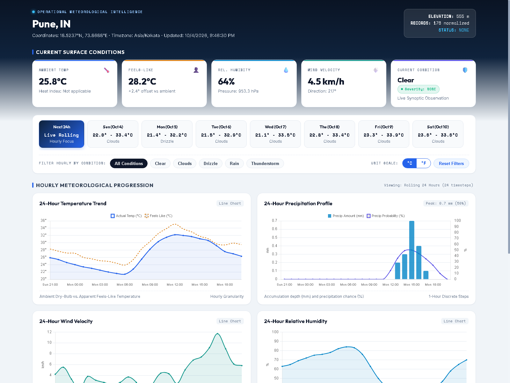
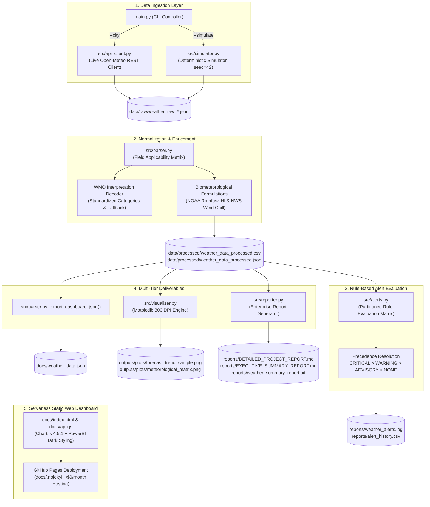

<div align="center">

# WEATHER FORECAST & ALERT APPLICATION

### **Enterprise Meteorological Forecasting, Biometeorological Analytics & Operational Alert Intelligence Platform**

**Dual-Engine Python Data Pipeline with Deterministic Simulation, NOAA Rothfusz Biometeorological Algorithms, Partitioned Rule-Based Alert Engine & Serverless Executive Web Dashboard**

[](LICENSE)
[](https://www.python.org/)
[-0284C7.svg?logo=openmeteo&logoColor=white)](https://open-meteo.com/)
[](https://pandas.pydata.org/)
[](https://matplotlib.org/)
[](https://developer.mozilla.org/en-US/docs/Web/JavaScript)
[](https://developer.mozilla.org/en-US/docs/Web/HTML)
[](https://developer.mozilla.org/en-US/docs/Web/CSS)
[](https://www.chartjs.org/)
[-0A9EDC.svg?logo=pytest&logoColor=white)](tests/)
[](https://girishshenoy16.github.io/weather-forecast-alert-app/)

---

A portfolio-grade meteorological forecasting engine and operational decision-support pipeline designed to ingest, normalize, and analyze high-resolution synoptic weather data across 7-day forecast horizons. Built with a **dual-engine ingestion architecture** (Live Open-Meteo REST API and byte-for-byte deterministic offline simulation), the platform evaluates partitioned multi-horizon threshold alerts (Extreme Heat/Cold, Precipitation Accumulation, Gale-Force Winds, Discomfort Advisories), applies rigorous biometeorological formulations (NOAA Rothfusz Heat Index with Fahrenheit primary gating and NWS Wind Chill), and deploys an interactive, client-side executive dashboard serverlessly via GitHub Pages with zero runtime server costs.

[**Live Dashboard**](https://girishshenoy16.github.io/weather-forecast-alert-app/) | [**Project Report**](reports/DETAILED_PROJECT_REPORT.md) | [**Executive Summary**](reports/EXECUTIVE_SUMMARY_REPORT.md)

---

## 1. Live Demo and Dashboard Preview

[]

*Executive Meteorological Operations Intelligence Dashboard — Interactive PowerBI-Style Static Web Analytics Platform deployed via GitHub Pages*

|                                 Top Section: Current Conditions                                  |                                         Middle Section: Hourly Progression                                          |                          Bottom Section: 7-Day Outlook & Advisories                           |
|:------------------------------------------------------------------------------------------------:|:-------------------------------------------------------------------------------------------------------------------:|:---------------------------------------------------------------------------------------------:|
| 5 Compact KPI cards: Ambient Temp, Feels-Like, Relative Humidity, Wind Velocity, and Status Pill | 4 Prioritized Chart.js charts: 24h Temperature, Precipitation, Wind, and Humidity with rolling/calendar-day filters | Dual-line 7-Day Temp Range, Daily Precipitation Accumulation, and Active Weather Alerts panel |

👉 **[Access the Live Weather Forecast & Alert Application Dashboard](https://girishshenoy16.github.io/weather-forecast-alert-app/)**

</div>

---

## 2. Project Statistics

<div align="center">

| Metric / Dimension             |      Verified System Value       | Technical & Methodological Specification                                                                                                 |
|:-------------------------------|:--------------------------------:|:-----------------------------------------------------------------------------------------------------------------------------------------|
| **Default Observation City**   |    **Pune, Maharashtra, IN**     | Geocoded dynamically: `18.5237°N, 73.8688°E`, Elevation: `555.0 m` via Open-Meteo API                                                    |
| **Weather Ingestion Layer**    |   **Dual-Engine Architecture**   | Live Open-Meteo REST API (HTTP Client) + Offline Deterministic Simulator (`seed=42`)                                                     |
| **Forecast Horizon**           | **7 Forward Days (176 Records)** | 1 Current Observation + 168 Hourly Timesteps + 7 Daily Synoptic Outlook Records                                                          |
| **Current Condition KPIs**     |      **5 Executive Cards**       | Ambient Temperature, Feels-Like Temperature, Relative Humidity, Wind Velocity, Status Pill                                               |
| **Interactive Chart Visuals**  |  **6 Chart.js Visualizations**   | 4 Hourly (Temp, Precip, Wind, Humidity) + 2 Daily (Temp Range, Precip Accumulation)                                                      |
| **Alert Engine Architecture**  | **Partitioned Threshold Matrix** | Partitioned across `CURRENT`, `HOURLY`, and `DAILY` with `CRITICAL > WARNING > ADVISORY > NONE`                                          |
| **Biometeorological Models**   |  **2 Scientific Formulations**   | Full 9-term NOAA Rothfusz Heat Index ($T_F \ge 80.0^\circ\text{F}$) & NWS Wind Chill ($T_C \le 10^\circ\text{C}, V \ge 4.8\text{ km/h}$) |
| **Deterministic Simulation**   |  **Byte-for-Byte Reproducible**  | Isolated `random.Random(seed=42)`, fixed epoch `2026-09-27T00:00:00Z`, binary `"wb"` writes                                              |
| **Static Publication Visuals** |     **2 Figures (300 DPI)**      | Dual-axis timeline (`forecast_trend_sample.png`) + 4-panel diagnostic matrix (`meteorological_matrix.png`)                               |
| **Automated Reports**          |  **3 Enterprise Deliverables**   | Technical Report (`.md`), Cross-Sector Executive Summary (`.md`), Meteorological Bulletin (`.txt`)                                       |
| **Automated Test Coverage**    |   **45 Tests Passing (100%)**    | 9 hermetic test modules running completely offline with zero live network calls and `tmp_path` isolation                                 |
| **Static Web Hosting Cost**    |         **\$0 / month**          | 100% static, serverless deployment on GitHub Pages (`docs/`) with zero backend server dependencies                                       |

</div>

---

## 3. Executive Overview and Problem Statement

### The Problem
Operational decision-makers across logistics, civil construction, municipal event planning, and agriculture routinely ingest weather forecasts to mitigate environmental risk. However, typical raw weather data integration introduces critical engineering bottlenecks:

* **Raw API Payloads Are Not Decision-Ready:** Upstream weather APIs (like Open-Meteo) return deeply nested JSON payloads containing parallel, disconnected coordinate arrays across varying temporal resolutions.
* **The "Zero vs. Null" Substitution Fallacy:** Generic data pipelines routinely replace missing or inapplicable physical metrics with `0` or `0.0`. In meteorological datasets, substituting missing temperature with $0^\circ\text{C}$ creates a false freeze alert, while substituting missing rain with $0\text{ mm}$ falsely masks observational gaps as clear weather.
* **Premature Biometeorological Boundary Rounding:** Algorithms calculating the NOAA Heat Index frequently convert thresholds prematurely to Celsius ($26.7^\circ\text{C}$). Because $80.0^\circ\text{F} \approx 26.6667^\circ\text{C}$, gating directly on $T_C < 26.7^\circ\text{C}$ erroneously discards valid boundary temperatures in the interval $[26.6667^\circ\text{C}, 26.7000^\circ\text{C})$.
* **API Volatility & Untestable Pipelines:** Relying strictly on external network calls makes automated test suites flaky, subject to rate limits (HTTP 429), and non-reproducible during continuous integration.
* **Dashboard Bloat & Client/Server Calculation Drift:** Interactive dashboards often duplicate statistical calculations in client-side JavaScript, causing discrepancies against back-office models and requiring expensive server runtimes (e.g., Streamlit, Dash).

### How This Project Solves These Issues

1. **25-Column Field Applicability Matrix & Strict Null Semantics:** Unpacks parallel arrays into a strictly partitioned schema (`CURRENT`, `HOURLY`, `DAILY`), preserving missing or inapplicable variables strictly as `None` (`null`) without falsifying zeros.
2. **Unambiguous Primary-Gate Biometeorological Formulations:** Dry-bulb temperature is converted to Fahrenheit first to evaluate the official NOAA $T_F \ge 80.0^\circ\text{F}$ boundary before Rothfusz regression, guaranteeing mathematical integrity.
3. **Byte-for-Byte Deterministic Simulator:** Implements an offline simulation engine with an isolated PRNG instance and fixed reference epoch, writing in binary mode (`"wb"`) to guarantee identical SHA-256 output across operating systems.
4. **Partitioned Multi-Horizon Alert Engine:** Evaluates operational thresholds independently across current conditions, 1-hour hourly rainfall, and 24-hour daily totals, resolving overlaps via a 4-tier severity precedence hierarchy.
5. **Precomputed Single Source of Truth (`docs/weather_data.json`):** Python precomputes all metrics, aggregations, and alert evaluations into a versioned JSON data contract. The client UI performs zero statistical recalculations.
6. **Serverless Static Architecture (\$0/month):** Fully decoupled static web client (`docs/index.html`, `docs/app.js`, `docs/style.css`) hosted serverlessly on GitHub Pages with zero cloud infrastructure overhead.

---

## 4. Key Features

### 4.1 Dual-Engine Ingestion Pipeline
* **Live Open-Meteo REST Client (`src/api_client.py`):** Queries Geocoding and Weather Forecast APIs with zero API key requirement under fair-use compliance headers.
* **Defensive HTTP Policies:** Bounded exponential backoff retry loop (maximum 3 attempts) with randomized jitter; explicit HTTP 429 rate limit backoff honoring `Retry-After` headers (capped safely at 30 seconds); and typed domain exceptions (`CityNotFoundError`, `APIRateLimitError`, `APIServerError`).
* **Deterministic Offline Simulator (`src/simulator.py`):** Synthesizes full 176-record weather payloads using an isolated `random.Random(seed=42)` instance and fixed reference epoch (`2026-09-27T00:00:00Z`).

### 4.2 Standardized Normalization & Data Contracts (`src/parser.py`)
* **25-Column Field Applicability Matrix:** Normalizes parallel arrays into flat records across `CURRENT` (1 record), `HOURLY` (168 records), and `DAILY` (7 records) partitions.
* **WMO Meteorological Code Decoding:** Decouples World Meteorological Organization (WMO) integer codes into standardized categories and human-readable descriptions, with safe fallback for unknown or future codes.
* **Explicit Interval Precipitation:** Differentiates `precip_current_mm` (instantaneous rate with interval duration) from `precip_amount_mm` (1-hour accumulation) and `precip_sum_daily_mm` (24-hour accumulation).

### 4.3 Biometeorological Derived Formulations
* **NOAA Rothfusz Heat Index:** Evaluates the full 9-term polynomial with preliminary Steadman screening and low/high relative humidity adjustments, strictly gated at $T_F \ge 80.0^\circ\text{F}$.
* **NWS Wind Chill Formula:** Computes wind chill with strict physical validity gating ($T_C \le 10.0^\circ\text{C}$ and $V \ge 4.8\text{ km/h}$).

### 4.4 Rule-Based Alert Engine (`src/alerts.py`)
* **Partitioned Horizon Rules:** Hourly rainfall evaluates $\ge 10\text{ mm}$ (WARNING) and $\ge 25\text{ mm}$ (CRITICAL); daily rainfall evaluates $\ge 50\text{ mm}$ (WARNING) and $\ge 100\text{ mm}$ (CRITICAL); wind evaluates $\ge 50\text{ km/h}$ (WARNING) and $\ge 75\text{ km/h}$ (CRITICAL).
* **Severity Precedence:** Resolves overlapping hazard triggers using maximum severity precedence (`CRITICAL > WARNING > ADVISORY > NONE`), concatenating trigger reasons into an audit log (`reports/weather_alerts.log`) and CSV history (`reports/alert_history.csv`).
* **Governance Tagging:** Attaches mandatory `alert_origin: "APPLICATION_RULE_ENGINE"` and non-official warning disclaimers to every alert record.

### 4.5 Executive Web Dashboard (`docs/`)
* **Visual Hierarchy:** Exactly 5 compact KPI cards, 4 hourly trend charts, 2 daily outlook charts, and 1 active alert advisory panel.
* **Dynamic Time Slicers:** Seamless toggle between a rolling forward-looking 24-hour view and individual calendar days.
* **Weather Condition Filter:** Filter hourly records by WMO condition (Rain, Drizzle, Clear, Thunderstorm) with toggle clearing and inline status badges.
* **Zero-Timestep Fallback:** Graceful empty-state card rendered when selected horizons or filter combinations produce zero records, avoiding misleading blank chart axes.
* **Dual Unit Toggle:** Instant client-side switching between Celsius (°C) and Fahrenheit (°F) across all KPIs, axis scales, and tooltip overlays.

### 4.6 Automated Multi-Format Reporting (`src/reporter.py`)
* **Technical Engineering Report (`reports/DETAILED_PROJECT_REPORT.md`):** Complete architectural documentation, mathematical proofs, and data dictionary.
* **Cross-Sector Executive Briefing (`reports/EXECUTIVE_SUMMARY_REPORT.md`):** Operational hazard assessments across Logistics, Agriculture, Aviation/Marine, Construction, and Public Events.
* **Meteorological Text Bulletin (`reports/weather_summary_report.txt`):** Plain-text ASCII bulletin formatted for terminal displays or automated dispatch.

---

## 5. Weather Analytics & KPI Scorecard

The table below documents the architectural dimensions and operational metrics produced for the default observation anchor (**Pune, IN**):

<div align="center">

| Metric / Dimension                | Verified System Dimension / Snapshot | Meteorological Significance & Processing Method                            |
|:----------------------------------|:------------------------------------:|:---------------------------------------------------------------------------|
| **Ambient Dry-Bulb Temperature**  |   **25.7°C** *(Dynamic Snapshot)*    | Standard dry-bulb temperature measured at 2m above ground level            |
| **Feels-Like Temperature**        |   **28.0°C** *(Dynamic Snapshot)*    | Native Open-Meteo biometeorological apparent temperature                   |
| **Relative Atmospheric Humidity** |   **64% RH** *(Dynamic Snapshot)*    | Percentage water vapor saturation relative to saturation vapor pressure    |
| **10m Sustained Wind Velocity**   |  **5.0 km/h** *(Dynamic Snapshot)*   | Horizontal wind speed measured at standard 10m anemometer height           |
| **Surface Atmospheric Pressure**  |  **953.2 hPa** *(Dynamic Snapshot)*  | Local surface barometric pressure adjusted for station elevation (555.0 m) |
| **Hourly Precipitation Horizon**  |        **168 Hours (7 Days)**        | Forward-looking 1-hour interval rainfall amounts (`precip_amount_mm`)      |
| **Daily Synoptic Precipitation**  |         **7 Calendar Days**          | 24-hour cumulative rainfall total (`precip_sum_daily_mm`)                  |
| **Active Operational Advisories** |     **0 Active (Status: NONE)**      | Evaluated across 176 records against local threshold matrix                |
| **Station Elevation**             |             **555.0 m**              | Authoritative station elevation resolved via Open-Meteo Geocoding API      |
| **Station Coordinates**           |       **18.5237°N, 73.8688°E**       | Authoritative WGS-84 geographic coordinates for Pune, Maharashtra, IN      |

</div>

> [!NOTE]
> Physical metrics (temperature, humidity, pressure, wind) represent dynamic forecast snapshots generated by the Open-Meteo API or offline simulation engine. Structural dimensions (176 records, 5 KPI cards, 6 charts, 45 tests) are permanent architectural contracts enforced by the test suite.

---

## 6. Dashboard Architecture and Data Contracts

The interactive web dashboard is engineered to provide complete operational situational awareness through a strictly calibrated visual hierarchy:

```
┌──────────────────────────────────────────────────────────────────────────┐
│ TOP: 5 COMPACT KPI CARDS                                                 │
│ [Ambient Temp]  [Feels-Like]  [Humidity]  [Wind Velocity]  [Condition]   │
├──────────────────────────────────────────────────────────────────────────┤
│ CONTROLS & INTERACTION BAR                                               │
│ [Day Slicer: Next 24h | Day 1 | ... | Day 7]  [Filter: Condition] [°C|°F]│
├──────────────────────────────────────────────────────────────────────────┤
│ MIDDLE: 24-HOUR HOURLY METEOROLOGICAL PROGRESSION (4 CHARTS)             │
│ ┌───────────────────────────┐      ┌───────────────────────────┐         │
│ │ 1. 24h Temperature Trend  │      │ 2. 24h Precipitation      │         │
│ │    (Line: Actual vs Feels)│      │    (Bar: mm, Line: %)     │         │
│ ├───────────────────────────┤      ├───────────────────────────┤         │
│ │ 3. 24h Wind Velocity      │      │ 4. 24h Relative Humidity  │         │
│ │    (Line: km/h)           │      │    (Line: % RH)           │         │
│ └───────────────────────────┘      └───────────────────────────┘         │
├──────────────────────────────────────────────────────────────────────────┤
│ BOTTOM: 7-DAY SYNOPTIC OUTLOOK & ADVISORIES (2 CHARTS + 1 PANEL)         │
│ ┌─────────────────────────┐  ┌─────────────────────────┐  ┌──────────┐   │
│ │ 5. 7-Day Temp Range     │  │ 6. 7-Day Precipitation  │  │ Active   │   │
│ │    (Dual-Line: High/Low)│  │    (Bar: mm/day)        │  │ Alerts   │   │
│ └─────────────────────────┘  └─────────────────────────┘  └──────────┘   │
└──────────────────────────────────────────────────────────────────────────┘
```

### Key Frontend Data Principles
* **Zero Client-Side Math:** JavaScript (`docs/app.js`) performs no meteorological or statistical recalculations. All values, moving windows, and alert tiers are precalculated by Python into `docs/weather_data.json`.
* **State Machine & Filter Resiliency:** When a user selects a day with 0 hourly observations or applies a filter yielding no matches, the dashboard destroys existing chart canvases and displays a contextual empty-state card with fallback actions (`[Switch to Next 24h]` or `[Show All Conditions]`), preventing blank axes.
* **Zero-Precipitation Semantic State:** When forecasted rainfall across a horizon is zero or negligible ($\le 0.05\text{ mm}$), the precipitation chart displays a clean subtitle note (`"No precipitation expected across this horizon"`) to inform operators rather than displaying confusing empty bars.

---

## 7. Technology Stack

<div align="center">

| Technical Domain            | Technology / Library |  Version   | Operational Function & Rationale                                                       |
|:----------------------------|:---------------------|:----------:|:---------------------------------------------------------------------------------------|
| **Language & Runtime**      | Python               |  3.11.9+   | Core data processing pipeline, biometeorological math, and master CLI orchestrator     |
| **HTTP Client & Ingestion** | Requests             |   2.31.0   | REST API client with timeout enforcement, exponential retry loops, and 429 safety caps |
| **Tabular Normalization**   | Pandas               |   2.2.2    | Data flattening, Field Applicability Matrix structuring, and CSV serialization         |
| **Static Visualizations**   | Matplotlib           |   3.8.4    | Generation of 2 publication-grade 300 DPI figures (`outputs/plots/`)                   |
| **CLI Formatting**          | Colorama             |   0.4.6    | Colorized terminal progress banners, stage notifications, and alert summaries          |
| **Report Generation**       | Jinja2               |   3.1.4    | Programmatic rendering of structured Markdown and plain-text bulletins                 |
| **Automated Testing**       | Pytest               |   8.2.2    | Master offline test suite with strict filesystem isolation via `tmp_path` fixtures     |
| **Interactive Client UI**   | HTML5 / CSS3 / ES6+  | Modern Web | PowerBI-inspired executive interface with CSS Grid and glassmorphism styling           |
| **Client Charting Engine**  | Chart.js             |   4.5.1    | High-performance interactive client-side rendering (local bundle with CDN fallback)    |
| **External Weather API**    | Open-Meteo REST API  | CC BY 4.0  | Real-time global geocoding and meteorological forecast data provider                   |
| **Static Web Hosting**      | GitHub Pages         | Serverless | \$0/month static hosting directly from the repository's `docs/` directory              |

</div>

---

## 8. System Architecture

The following diagram illustrates the complete end-to-end data pipeline from initial ingestion through multi-tier deliverable generation:



---

## 9. Installation and Quickstart

### Prerequisites
* **Python**: Version 3.11+ installed.
* **Git**: Installed for version control.
* **Web Browser**: Modern browser (Chrome, Edge, Firefox, Safari) for dashboard viewing.

### Setup Guide (Windows PowerShell)

```powershell
# 1. Clone repository
git clone https://github.com/girishshenoy16/weather-forecast-alert-app.git
cd "weather-forecast-alert-app"

# 2. Create isolated virtual environment
python -m venv venv

# 3. Activate virtual environment
.\venv\Scripts\Activate.ps1

# 4. Install exact pinned dependencies
python.exe -m pip install --upgrade pip
pip install -r requirements.txt
```

### Execution Options (`main.py`)

```powershell
# Run live forecast for default city (Pune, IN)
python main.py

# Run live forecast for any global city
python main.py --city "Tokyo"
python main.py --city "London"

# Run completely offline deterministic simulation (zero live network traffic)
python main.py --simulate

# Run simulation with custom random seed and baseline timestamp
python main.py --simulate --seed 100 --ref-time "2026-10-01T00:00:00Z"

# Skip static plot generation (faster execution)
python main.py --no-plots

# Skip dashboard JSON export
python main.py --no-dashboard

# Direct output artifacts to custom directory
python main.py --output-dir "sandbox/outputs"
```

### Execute Test Suite

```powershell
# Run the complete hermetic test suite (45 tests, ~7.5 seconds)
python -m pytest -v
```

### Serve Executive Dashboard Locally

```powershell
# Start local static web server
python -m http.server 8000 -d docs

# Navigate to in your browser:
# http://localhost:8000
```

---

## 10. Repository Directory Structure

```text
Weather Forecast & Alert Application/
├── data/
│   ├── raw/                              # Persisted raw API responses and simulated payloads
│   └── processed/                        # 25-column normalized datasets
├── docs/                                 # Static Executive Web Dashboard (GitHub Pages)
│   ├── index.html                        # Executive dashboard scaffold & semantic DOM
│   ├── style.css                         # PowerBI glassmorphism dark stylesheet
│   ├── app.js                            # Client-side Chart.js controller & state machine
│   └── weather_data.json                 # Precomputed frontend JSON data contract
├── images/                               # Showcase documentation visual assets
│   ├── dashboard_preview.png             # High-resolution dashboard screenshot
│   └── cli_terminal_output.png           # Terminal execution capture with colorama
├── reports/                              # Automated enterprise operational intelligence
│   ├── DETAILED_PROJECT_REPORT.md        # Technical engineering architecture report
│   └── EXECUTIVE_SUMMARY_REPORT.md       # Cross-sector operational business summary
├── src/                                  # Production application source code
│   ├── __init__.py                       # Package initialization marker
│   ├── api_client.py                     # Open-Meteo REST client with bounded retry loops
│   ├── simulator.py                      # Deterministic byte-for-byte simulator engine
│   ├── parser.py                         # Normalizer, Rothfusz regression & Wind Chill math
│   ├── alerts.py                         # Rule-based threshold alert engine
│   ├── visualizer.py                     # 300 DPI publication-grade Matplotlib generator
│   ├── reporter.py                       # Enterprise Markdown and text bulletin generator
│   └── config.py                         # Centralized configuration, thresholds & exceptions
├── tests/                                # Master offline test suite (45 tests passing)
│   ├── __init__.py                       # Test package initialization marker
│   ├── test_alerts.py                    # Partitioned alert rule tests (5 checks)
│   ├── test_api_client.py                # Mocked API client and retry tests (11 checks)
│   ├── test_dashboard.py                 # JSON data contract and isolation tests (5 checks)
│   ├── test_logger.py                    # Logging handler and formatting tests (3 checks)
│   ├── test_main.py                      # CLI pipeline integration tests (2 checks)
│   ├── test_parser.py                    # Biometeorological math & null tests (7 checks)
│   ├── test_reporter.py                  # Enterprise report generation tests (4 checks)
│   ├── test_simulator.py                 # Simulator determinism & byte tests (5 checks)
│   └── test_visualizer.py                # Matplotlib figure generation tests (3 checks)
├── main.py                               # Unified CLI driver and pipeline orchestrator
├── requirements.txt                      # Exact pinned project dependencies
├── LICENSE                               # MIT License and CC BY 4.0 data attribution
└── README.md                             # Authoritative project documentation
```

---

## 11. Meteorological Methodology & Formulations

### 1. NOAA Rothfusz Heat Index Regression
The Heat Index measures the perceived temperature resulting from combined ambient dry-bulb temperature and relative humidity:

* **Fahrenheit Conversion**:
  $$T_F = T_C \times \frac{9}{5} + 32$$
* **Primary Validity Gate**: Strictly gated at $T_F \ge 80.0^\circ\text{F}$. If $T_F < 80.0^\circ\text{F}$ or either input is `None`, the algorithm returns `None`.
* **Preliminary Steadman Equation**:
  $$HI_{\text{simple}} = 0.5 \times \left(T_F + 61.0 + [(T_F - 68.0) \times 1.2] + [RH \times 0.094]\right)$$
  If the average $(HI_{\text{simple}} + T_F) / 2 < 80.0^\circ\text{F}$, $HI_{\text{simple}}$ is adopted. Otherwise, the full 9-term Rothfusz polynomial is evaluated:
  $$HI_F = -42.379 + 2.04901523 T_F + 10.14333127 RH - 0.22475541 T_F RH - 0.00683783 T_F^2 - 0.05481717 RH^2 + 0.00122874 T_F^2 RH + 0.00085282 T_F RH^2 - 0.00000199 T_F^2 RH^2$$
* **Low-Humidity Adjustment** ($RH < 13\%$ and $80^\circ\text{F} \le T_F \le 112^\circ\text{F}$):
  $$\Delta HI_{\text{low}} = -\left(\frac{13 - RH}{4}\right) \sqrt{\frac{17 - |T_F - 95|}{17}}$$
* **High-Humidity Adjustment** ($RH > 85\%$ and $80^\circ\text{F} \le T_F \le 87^\circ\text{F}$):
  $$\Delta HI_{\text{high}} = +\left(\frac{RH - 85}{10}\right) \times \left(\frac{87 - T_F}{5}\right)$$
* **Celsius Conversion**:
  $$HI_C = (HI_F - 32) \times \frac{5}{9}$$

### 2. NWS Wind Chill Formulation
Wind Chill evaluates the rate of heat loss from exposed skin caused by cold ambient temperatures and wind:

* **Physical Gating**: Evaluated strictly when ambient dry-bulb temperature $T_C \le 10.0^\circ\text{C}$ ($50.0^\circ\text{F}$) and wind velocity $V \ge 4.8\text{ km/h}$ ($3.0\text{ mph}$).
* **Formulation**:
  $$WC_C = 13.12 + 0.6215 T_C - 11.37 V^{0.16} + 0.3965 T_C V^{0.16}$$

### 3. Precipitation Semantics
Precipitation measurements are partitioned by exact temporal duration to prevent false rate comparisons:
* `precip_current_mm`: Immediate observation rate accompanied by `precip_current_interval_seconds` (e.g., 900 seconds).
* `precip_amount_mm`: Total water accumulation over a discrete 1-hour hourly window.
* `precip_sum_daily_mm`: Total 24-hour water accumulation aggregated across calendar days.

### 4. WMO Synoptic Classification & Fallback
Maps integer codes defined by the World Meteorological Organization into operational categories:
* `0`: Clear sky (`Clear`)
* `1, 2, 3`: Mainly clear, partly cloudy, overcast (`Cloudy`)
* `51–55`: Drizzle: Light, moderate, dense (`Drizzle`)
* `61–65`: Rain: Slight, moderate, heavy (`Rain`)
* `71–75`: Snow fall: Slight, moderate, heavy (`Snow`)
* `95, 96, 99`: Thunderstorm: Slight, moderate, with hail (`Thunderstorm`)
* **Unknown Fallback**: Any unmapped integer code safely defaults to `weather_category="Unknown"` and `weather_description="Unknown weather code (<code>)"`, preventing runtime key errors.

---

## 12. Alert and Safety Architecture

The rule-based alert engine evaluates partitioned environmental thresholds independently across observation horizons:

<div align="center">

| Partition   | Hazard Classification    | Evaluation Variable             |              Advisory Threshold              |    Warning Threshold     |    Critical Threshold    |
|:------------|:-------------------------|:--------------------------------|:--------------------------------------------:|:------------------------:|:------------------------:|
| **CURRENT** | Extreme Heat             | `temp_celsius`                  |                      —                       | $\ge 35.0^\circ\text{C}$ | $\ge 38.0^\circ\text{C}$ |
| **CURRENT** | Extreme Cold / Frost     | `temp_celsius`                  |                      —                       | $\le 0.0^\circ\text{C}$  | $\le -5.0^\circ\text{C}$ |
| **CURRENT** | Gale-Force Wind          | `wind_speed_kmh`                |                      —                       |  $\ge 50.0\text{ km/h}$  |  $\ge 75.0\text{ km/h}$  |
| **CURRENT** | Severe Convective Storm  | `wmo_code`                      |                      —                       | WMO $\in \{95, 96, 99\}$ |            —             |
| **CURRENT** | Thermal Discomfort       | `temp_celsius` & `humidity_pct` | $T_C \ge 30^\circ\text{C} \land RH \ge 80\%$ |            —             |            —             |
| **HOURLY**  | 1-Hour Flash Rainfall    | `precip_amount_mm`              |                      —                       |   $\ge 10.0\text{ mm}$   |   $\ge 25.0\text{ mm}$   |
| **HOURLY**  | Hourly Temperature Spike | `temp_celsius`                  |                      —                       | $\ge 35.0^\circ\text{C}$ | $\ge 38.0^\circ\text{C}$ |
| **DAILY**   | 24-Hour Synoptic Deluge  | `precip_sum_daily_mm`           |                      —                       |   $\ge 50.0\text{ mm}$   |  $\ge 100.0\text{ mm}$   |
| **DAILY**   | Daily Peak Gale Gust     | `wind_speed_max_kmh`            |                      —                       |  $\ge 50.0\text{ km/h}$  |  $\ge 75.0\text{ km/h}$  |

</div>

### Precedence Resolution Hierarchy
When an observation triggers multiple thresholds simultaneously, the engine resolves to the single highest severity tier:
$$\text{CRITICAL} \succ \text{WARNING} \succ \text{ADVISORY} \succ \text{NONE}$$
All trigger reasons are concatenated (e.g., `HEAT_WARNING; HIGH_WIND_WARNING`) to ensure operators retain full visibility into compounding hazards.

> [!WARNING]
> **Non-Official Warning Disclaimer:** Weather advisories produced by this software are generated automatically by rule-based threshold evaluation for operational planning and educational demonstration. **This application does not issue official government meteorological warnings.** For official life-safety warnings, refer to authorized national meteorological agencies (e.g., IMD, NOAA, UK Met Office).

---

## 13. Testing and Quality Assurance

The project enforces quality assurance through **45 automated tests** executing in **~7.5 seconds** with **100% pass rate** in offline mode:

<div align="center">

| Test Suite Module              | File Path                           |    Checks     | Validated Requirements & Assertions                                                                               |   Status    |
|:-------------------------------|:------------------------------------|:-------------:|:------------------------------------------------------------------------------------------------------------------|:-----------:|
| **Alert Rules & Precedence**   | `tests/test_alerts.py`              |       5       | Partitioned rule triggers, severity hierarchy resolution, discomfort logic, null safety, isolated output          |   ✅ PASS   |
| **API Client & Retry Backoff** | `tests/test_api_client.py`          |      11       | Geocoding parsing, missing results, 429 backoff with safety caps, transient 5xx retries, fast deterministic mocks |   ✅ PASS   |
| **Dashboard JSON Contract**    | `tests/test_dashboard.py`           |       5       | Schema key integrity, legal notice presence, empty record resilience, HTML non-generation isolation               |   ✅ PASS   |
| **Logging & Formatting**       | `tests/test_logger.py`              |       3       | Log directory creation, level filtering, idempotent handler attachment                                            |   ✅ PASS   |
| **Pipeline CLI Driver**        | `tests/test_main.py`                |       2       | End-to-end simulation execution, `--no-plots` and `--no-dashboard` flag skipping in sandbox                       |   ✅ PASS   |
| **Parser & Biometeorology**    | `tests/test_parser.py`              |       7       | WMO decoding, apparent temp passthrough, Rothfusz Fahrenheit boundary gate, Wind Chill gating, strict nulls       |   ✅ PASS   |
| **Enterprise Reporting**       | `tests/test_reporter.py`            |       4       | Detailed markdown report, executive summary, text bulletin formatting, isolated directory export                  |   ✅ PASS   |
| **Deterministic Simulator**    | `tests/test_simulator.py`           |       5       | Schema compliance, rounding rules, fixed epoch alignment, in-memory & disk byte-for-byte reproducibility          |   ✅ PASS   |
| **Matplotlib Visualizer**      | `tests/test_visualizer.py`          |       3       | 300 DPI timeline generation, 4-panel diagnostic matrix generation, missing value handling                         |   ✅ PASS   |
| **Master Test Harness**        | **Comprehensive System Validation** | **45 Checks** | **100% Offline Passing; Zero Live Network Calls; Full `tmp_path` Test Output Isolation**                          | **✅ PASS** |

</div>

```text
============================= test session starts =============================
platform win32 -- Python 3.11.9, pytest-8.2.2, pluggy-1.6.0
rootdir: D:\Projects\Diploma\Python\Weather Forecast & Alert Application
collected 45 items

tests/test_alerts.py .....                                               [ 11%]
tests/test_api_client.py ...........                                     [ 35%]
tests/test_dashboard.py .....                                            [ 46%]
tests/test_logger.py ...                                                 [ 53%]
tests/test_main.py ..                                                    [ 57%]
tests/test_parser.py .......                                             [ 73%]
tests/test_reporter.py ....                                              [ 82%]
tests/test_simulator.py .....                                            [ 93%]
tests/test_visualizer.py ...                                             [100%]

======================= 45 passed in 7.48s =======================
```

### Test Isolation & Determinism
* **Filesystem Isolation:** All test modules utilize pytest's `tmp_path` fixture to redirect all generated outputs (`weather_data.json`, `weather_alerts.log`, plots, reports), guaranteeing production workspaces remain unpolluted.
* **Deterministic Retries:** `time.sleep` and random backoff jitter are mocked in unit tests, allowing full retry exhaustion testing (3 attempts) in less than 2 milliseconds.

---

## 14. Defensive Engineering & Quality Guardrails

* **HTTP Resilience & Safety Caps:** `src/api_client.py` enforces a maximum 3-attempt retry loop with exponential backoff and jitter. HTTP 429 `Retry-After` waits are capped at 30 seconds to prevent execution hangs.
* **Strict Null Preservation:** Missing sensor metrics are kept as `None` (`null`), avoiding data corruption where $0^\circ\text{C}$ indicates false freezing.
* **WMO Unknown Code Fallback:** Unrecognized integer codes safely resolve to `"Unknown"` categories rather than raising unhandled exceptions.
* **Isolated PRNG State:** `src/simulator.py` instantiates an independent `random.Random(seed=42)` instance, preventing contamination of Python's global random state.
* **Cross-Platform Binary Writes:** The simulator writes JSON in binary mode (`"wb"`) with sorted keys and normalized line endings, guaranteeing identical SHA-256 hashes across Windows, Linux, and macOS.
* **Dynamic Geocoding:** Station coordinates (`18.5237°N, 73.8688°E`) and elevation (`555.0 m`) are resolved dynamically from the API and propagated via data contract without frontend hardcoding.

---

## 15. Limitations and Future Scope

### Limitations & Assumptions
* **Upstream API Dependency:** Real-time data availability depends on Open-Meteo REST API uptime and rate limits (managed by the offline simulator during outages).
* **Static Dashboard Architecture:** The web dashboard operates client-side without persistent user authentication or real-time WebSocket push streams.
* **Rule-Based Decision Support:** Alert flags are deterministic threshold rules and do not incorporate complex atmospheric radar extrapolation.

### Future Scope & Roadmap
* **Push Notification Dispatchers:** Integration with Webhooks, Telegram Bots, and SMTP email alerts for automated dispatch.
* **Historical Database Storage:** Persistence of multi-year synoptic histories in SQLite or PostgreSQL for longitudinal trend analysis.
* **Multi-City Comparison Matrix:** Multi-location synoptic dashboards supporting side-by-side comparative forecasting.
* **PWA & Offline Service Worker:** Progressive Web App caching enabling full dashboard functionality even when disconnected from the local server.

---

## 16. Reports and Documentation

The automated reporting pipeline produces three standardized deliverables:

<div align="center">

| Deliverable Document           | Relative Path                                                                | Target Audience               | Primary Contents & Focus                                                                        |
|:-------------------------------|:-----------------------------------------------------------------------------|:------------------------------|:------------------------------------------------------------------------------------------------|
| **Detailed Technical Report**  | [`reports/DETAILED_PROJECT_REPORT.md`](reports/DETAILED_PROJECT_REPORT.md)   | Technical Mentors & Reviewers | Comprehensive engineering report: architecture, biometeorological math, data dictionary & tests |
| **Executive Business Summary** | [`reports/EXECUTIVE_SUMMARY_REPORT.md`](reports/EXECUTIVE_SUMMARY_REPORT.md) | Operations & Business Leaders | Cross-sector hazard assessments: Logistics, Agriculture, Aviation, Construction, and Events     |
</div>

---

## 17. Contact and License

### Author Contact

<div align="center">

**Girish Shenoy**

[](https://github.com/girishshenoy16)
[](https://linkedin.com/in/girishshenoys)
[](mailto:girishpshenoy09@gmail.com)

</div>

### Software License & Data Attribution
* **Software License:** Released under the **MIT License** — Copyright (c) 2026 Girish Shenoy.
* **Weather Data Attribution:** Weather forecasts and geocoding services provided by [Open-Meteo.com](https://open-meteo.com/) under the [Creative Commons Attribution 4.0 International (CC BY 4.0)](https://creativecommons.org/licenses/by/4.0/) license.
* **Statutory Operational Disclaimer:** Engineered strictly for **educational, academic research, and operational decision-support purposes**. Does not issue official government meteorological warnings.

---

<div align="center">

**Engineered for meteorological precision. Validated for deterministic reliability. Documented for operational clarity.**

Weather Forecast & Alert Application v1.0 — A Python & Vanilla Web Weather Intelligence Platform

</div>
